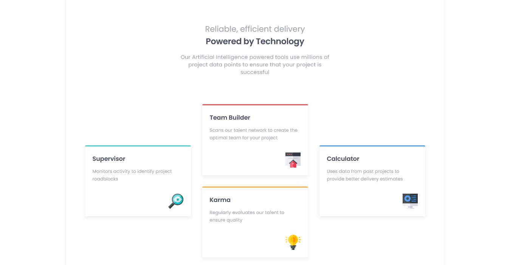

# Frontend Mentor - Four card feature section solution

This is a solution to the [Four card feature section challenge on Frontend Mentor](https://www.frontendmentor.io/challenges/four-card-feature-section-weK1eFYK). Frontend Mentor challenges help you improve your coding skills by building realistic projects. 

## Table of contents

- [Overview](#overview)
  - [The challenge](#the-challenge)
  - [Screenshot](#screenshot)
  - [Links](#links)
- [My process](#my-process)
  - [Built with](#built-with)
  - [What I learned](#what-i-learned)
  - [Continued development](#continued-development)
  - [Useful resources](#useful-resources)
- [Author](#author)
- [Acknowledgments](#acknowledgments)

## Overview
- This is a challenge to build a four card feature section gotten from frontendmentor.io .
### The challenge

Users should be able to:

- View the optimal layout for the site depending on their device's screen size

### Screenshot
                

### Links

- Solution URL: [Solution URL](https://github.com/Akinyemi4/four-card-feature)
- Live Site URL: [Live Site URL](https://four-card-feature-akinyemi4.netlify.app/)

## My process

- I begin with the HTML as usual then proceed to CSS to style it.

### Built with

- Semantic HTML5 markup
- CSS custom properties
- Flexbox
- CSS Grid

### What I learned

- Here, i learnt a lot in this challenge as regards layouts and its setting.
- I learnt how to use a major css property "align-self"

### Continued development

- I think with the projects done so far I now understand firmly the use of CSS grid and how powerful it's so I'll like to work more on building landing pages and more complex components.
                    
## Author

- Frontend Mentor - [@Akinyemi4](https://www.frontendmentor.io/profile/Akinyemi4)

## Acknowledgments

- I'll also express my gratitude to frontendmentor.io team they've beeen amazing.
